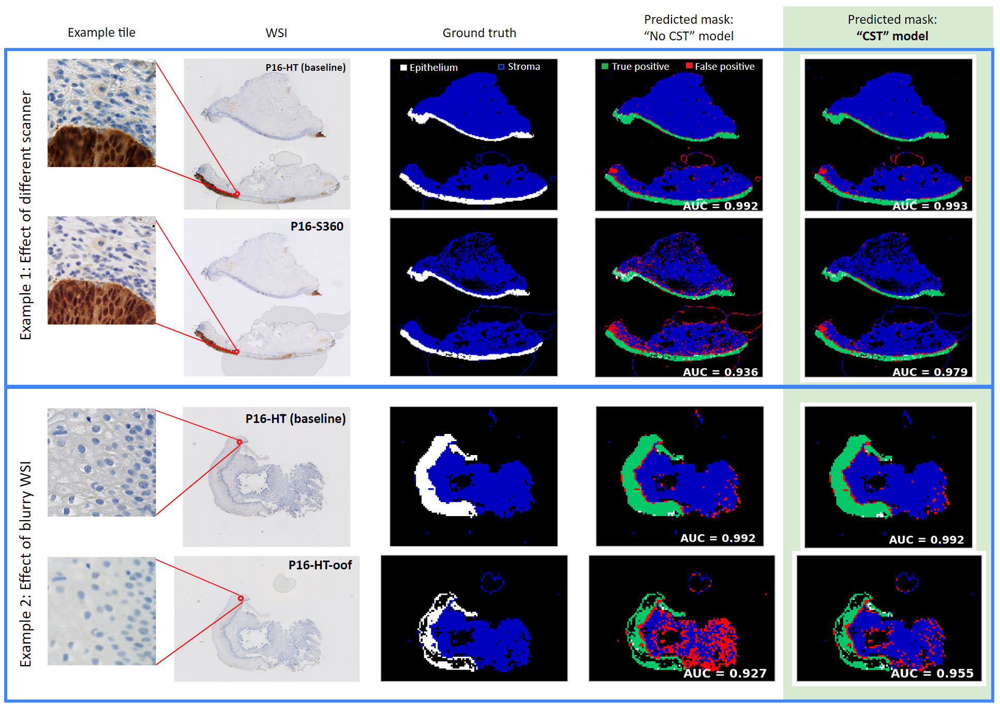

# Contrastive Learning-based Stability Training

Contrastive Learning-based Stability Training (CST), in the context of deep learning for digital pathology, is proposed as a method to increase DL model robustness to image variability caused by the use of different slide scanners and IHC stains. Distortions in color, contrast, brightness and blur were used for CST, in accordance with the perceived differences between WSIs  from different scanners and with different IHC.



## Requirements

python 3.6

CUDA 10.0 (or CUDA >= 10.0 for the docker setup)

python libraries: 
- protobuf<4.21.0
- tensorflow-gpu==1.13.1
- numpy==1.16.4
- scipy==1.2.1
- opencv-python==4.1.0.25
- matplotlib
- ipykernel
- pillow==6.0.0
- h5py==2.10.0
- requests==2.27.1

## Setup

#### With docker

Build image:

``` bash
$ sudo docker build -f Dockerfile --tag cst_v1 .
```

Run image:

```bash
$ sudo docker run -p <port>  --user $(id -u):$(id -g) -it --rm -v </path/to/this/repository>:/main_dir/CST_v1 --gpus <gpus> cst_v1:latest /bin/bash
# e.g. $ sudo docker run -p 8888:8888  --user $(id -u):$(id -g) -it --rm -v ~/my_projects/CST_v1:/main_dir/CST_v1 --gpus all cst_v1:latest /bin/bash
# OBS: adapt volumes if a different path is needed for the data. Otherwise, move data to the 'CST_v1/data'
# OBS: change port, select gpus, add user permissions (e.g. --user 1000:1000) or generally modify the run command as needed. 


```

#### Without docker 
1. Install cuda...

2. Install libraries: 
```bash 
$ pip install -r requirements.txt
```


## Usage

#### With docker:

Download datasets: 
```bash
$ python3 load_data.py --name <dataset1> <dataset2> ...  # options are idc, cifar-10, cifar-10-c. Default is idc
# e.g. $ python3 load_data.py --name idc cifar-10
```

Train network:

```bash
$ python3 train.py --conf <conf_path> # conf_path is the path to a config json file with the parameters. Default is train_config.json
# e.g. $ python3 train.py --conf train_config.json
```

Run jupyter notebooks:
```bash
$ jupyter notebook --ip 0.0.0.0 --port 8888 --allow-root
```

Then open the url in your browser.

#### Without docker:

Same us above. If python 3.6 is your default version, just use python instead of python3.6


## Config file for training
This file contains all the parameters that need to be set to train a network using CST. The file "train_config.json" is included for illustration purposes:


```json
{
    "tile_size": 128,                             # size of the image (for now only square image)
    "alpha": 1.0,                                 # weight of stability component
    "dist_params": {                              # dict containing the distortions
        "contrast": {"lower": 0.8, "upper": 1.2}, # random contrast within range [lower, upper]
        "color": {"factor": [20,0,20]},           # random color on each RGB channel within [-factor[i], factor[i]] (0 to 255)
        "blur": {"kernel_size": 1, "sigma": 3.0}, # conv with gaussian kernel of size 2*kernel_size+1 and random std within [0, sigma]
        "brightness": {"max_delta":0.3}           # random brightness within [-delta, delta]
    },
    "optimizer": {                                # optimizer (tf.keras.optimizers)
        "class_name": "Adam",                     # name (e.g. Adam, SGD, ...)
        "config": {                               # args
            "lr": 0.0001,
            "amsgrad": true
        }
    },
    "loss": "binary_crossentropy",                # loss (tf.keras.losses)
    "class_mode": "binary",                       # class mode ("binary" or "categorical")
    "pretrained_model_path": null,                # path of custom model if exists. CST will be used to retrain
    "save_all_epochs": true,                      # if true, all epochs are saved
    "model_save_path": "models",                  # path to save models
    "model_name": "default_model_name",           # name of models to save, will be saved as "model_name.h5"
    "save_metrics": true,                         # if true, creates csv and adds metrics on epoch end
    "epochs": 10,                                 # n of epochs
    "batch_size": 32,                             # batch size
    "metrics": ["binary_crossentropy", "recall_m", "precision_m", "f1_m", "auc_m"],  # metrics (tf.keras.metrics) Additionaly, "recall_m", "precision_m", "f1_m", "auc_m" are custom metrics available optionally
    "train_data_path": "data/aj/IDC_regular_ps50_idx5",  # path of train data
    "val_data_path": null,                        # path of validation data
    "val_split": 0.2                              # validation split if "val_data_path" is null
}
```

## License
[MIT](https://choosealicense.com/licenses/mit/)